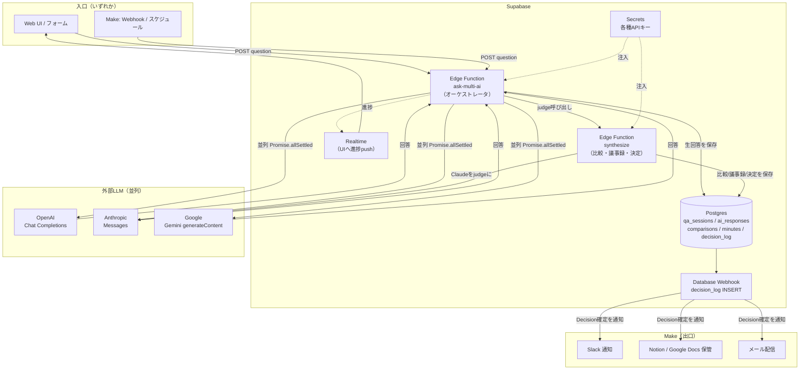
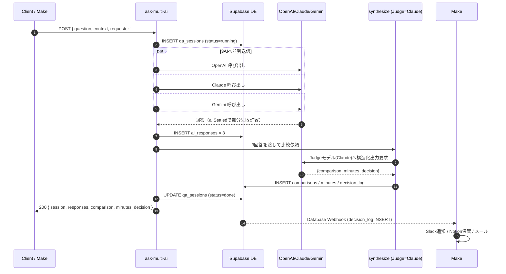
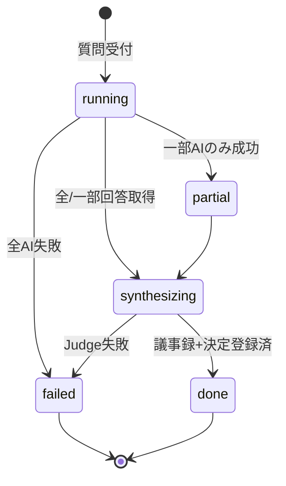
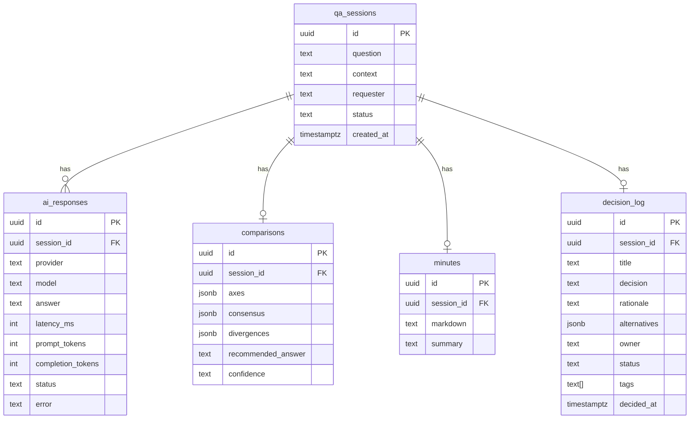

# マルチAI並列比較システム 設計書

> 1回の質問を **OpenAI / Claude / Gemini** の3AIへ並列送信し、
> 回答取得 → 比較 → 議事録生成 → Decision Log 登録 まで自動で行うシステム。
> **Supabase を中心**に据え、オーケストレーションは **Edge Functions (Deno)**、
> 外部連携・通知・スケジュールは **Make** が担う。

---

## 1. 目的とスコープ

| 項目 | 内容 |
|------|------|
| 目的 | 単一の問いに対する複数LLMの回答を横並び比較し、意思決定を高速化・記録化する |
| 入力 | 質問文（`question`）＋ 任意のコンテキスト（`context`）＋ 依頼者（`requester`） |
| 出力 | ① 3AIの生回答 ② 比較マトリクス ③ 議事録(Markdown) ④ Decision Log 1件 |
| 非機能 | 部分障害耐性（1AIが落ちても継続）／各AIタイムアウト60秒／全処理を1トランザクション相当で記録 |
| 中心DB | Supabase (Postgres + RLS + Realtime + Edge Functions + Secrets) |
| 連携 | Make（トリガ・Slack/メール通知・Notion/Googleドキュメント保管） |

---

## 2. 全体アーキテクチャ



**役割分担の原則**

- **Edge Functions** … LLM並列呼び出し・整形・DB書き込みという「低遅延で完結すべき処理」。
- **Make** … 「人・外部SaaSへ届ける処理」（通知・保管・定期実行）。Edge Functionを叩く側にも、Webhookで叩かれる側にもなれる。
- **Supabase DB** … 唯一の信頼できる記録（source of truth）。Decision Log 確定を Database Webhook で検知し Make へ流す。

---

## 3. 処理シーケンス



**状態遷移（qa_sessions.status）**



---

## 4. データモデル (ER図)



DDL は [`supabase/migrations/0001_multi_ai.sql`](../../supabase/migrations/0001_multi_ai.sql) を参照。

---

## 5. 並列送信の設計ポイント

1. **Promise.allSettled** … 3プロバイダを同時起動。1つがタイムアウト/エラーでも残りで続行（`status=partial`）。
2. **プロバイダ・アダプタ** … 各社APIの差異（メッセージ形式・トークン集計）を `_shared/providers.ts` で正規化し、`AiResult` という共通形へ。
3. **タイムアウト** … `AbortSignal.timeout(60_000)` を各fetchに付与。Edge Functionの実行上限内に収める。
4. **コスト/レイテンシ記録** … `ai_responses` に `latency_ms` とトークン数を保存し、後日のプロバイダ評価に使う。
5. **Judge（比較役）** … 生成能力が高い Claude を既定のjudgeに採用。3回答を渡し、**比較マトリクス＋議事録＋決定案**を1回の構造化出力(JSON)で生成 → API往復を最小化。

---

## 6. Edge Functions 構成

```
supabase/functions/
├── _shared/
│   ├── cors.ts          # CORSヘッダ
│   ├── providers.ts     # OpenAI/Claude/Gemini アダプタ（並列送信の実体）
│   └── synthesize.ts    # Judge呼び出し＆結果パース（比較・議事録・決定）
├── ask-multi-ai/
│   └── index.ts         # オーケストレータ（入口）
└── synthesize/
    └── index.ts         # 比較のみ再実行するためのスタンドアロン
```

- **ask-multi-ai** … 本命の入口。並列送信→保存→synthesize→保存→返却まで一気通貫。
- **synthesize** … 既存セッションの回答を使って比較・議事録を作り直す再実行用（judgeモデル差し替え検証など）。

デプロイ:
```bash
supabase functions deploy ask-multi-ai --no-verify-jwt   # Makeから叩く場合はJWT無効化＋独自トークン検証
supabase functions deploy synthesize
supabase secrets set OPENAI_API_KEY=... ANTHROPIC_API_KEY=... GEMINI_API_KEY=... EDGE_SHARED_TOKEN=...
```

---

## 7. Make シナリオ

詳細は [`make/scenario.md`](../../make/scenario.md)。要点:

- **入口シナリオ**: Webhook受信 or スケジュール → HTTPモジュールで `ask-multi-ai` をPOST（`x-edge-token` ヘッダ付き）。
- **出口シナリオ**: Supabase Database Webhook（`decision_log` INSERT）→ Make Webhook → Slack / Notion / Gmail へ分岐。

---

## 8. セキュリティ

- LLM APIキーは **Supabase Secrets** にのみ保管。クライアントへ露出しない。
- `ask-multi-ai` は `--no-verify-jwt` で公開しつつ、`x-edge-token`（`EDGE_SHARED_TOKEN`）で発信元を検証。UIから叩く場合は Supabase Auth JWT を検証する構成に切替可。
- テーブルは RLS 有効。書き込みは Edge Function（service_role）のみ、読み取りは認証ユーザーに限定。

---

## 9. 拡張余地

- プロバイダ追加は `providers.ts` にアダプタを1つ足すだけ（`AiResult` 準拠）。
- Judgeを多数決/ルーブリック評価に差し替え可能（`synthesize.ts` のプロンプト差替）。
- `ai_responses` の蓄積で「案件種別 × 最良プロバイダ」の自動ルーティングへ発展可能。
