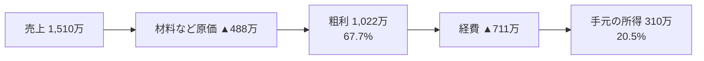

# 令和7年 確定申告 実績（数字の正本）

**REVO の実際の数字はこのファイルが正本。事業計画書・シナリオはすべてここを参照する。**

- 対象: 令和7年分 確定申告（創業年＝1年目）
- 登録日: 2026-07-15
- 体制: 職人本人（1人）が施工

## 損益の全体像

| 項目 | 金額 | 率 |
|---|---|---|
| 売上 | **15,097,601円**（約1,510万円） | 100% |
| 売上原価 | 4,882,538円（約488万円） | 32.3% |
| **粗利** | **10,215,063円**（約1,022万円） | **67.7%** |
| 経費合計 | 7,114,765円（約711万円）※粗利−所得から算出 | 47.1% |
| **事業所得** | **3,100,298円**（約310万円） | **20.5%** |

## 経費の内訳（主要項目）

| 項目 | 金額 | メモ |
|---|---|---|
| 消耗品費 | 1,869,265円 | 創業年の**電動工具一式**を含む（来年は減る見込み） |
| リース料 | 873,500円 | |
| 地代家賃 | 486,057円 | **事務所兼自宅**のため家賃を含む |
| 接待交際費 | 388,635円 | |
| 車両費 | 318,601円 | **車両故障→中古車買替**の年（一時要因あり） |
| 通信費 | 302,833円 | |
| その他経費 | 271,641円 | |
| 主要項目 計 | 4,510,532円 | |
| **⚠️ 差額（未内訳）** | **約2,604,233円** | 経費合計711万との差。減価償却費・保険料・水道光熱費等と思われる。**確定申告書の内訳で要確認・要追記** |

## この数字からわかる大事なこと

| 事実 | 意味 |
|---|---|
| 粗利率 67.7% | **本人施工だから高い**。腕がそのまま利益になっている |
| 外注に出すと粗利率 約20% | 同じ売上100万円でも、自分がやれば68万円、外注に出せば**20万円**しか残らない |
| 売上1,510万＝月平均 約126万 | これが**1人の体でこなせる現在の上限の目安** |
| 創業年の一時費用あり | 工具一式・車買替。2年目は経費が下がる余地がある |

## 来年に向けて計測が必要な数字（★＝まだ無い）

- ★ 月別の売上（繁忙・閑散の波）
- ★ 年間の工事件数と平均単価
- ★ 1件あたりの事務時間（実測）
- ★ 元請経由と直請けの割合・単価差

→ 事務サポに全案件を登録すれば、来年はこの表が自動で埋まる。

## 関連資料

- この数字を使った成長の道すじ → [成長シナリオ_2000万2500万.md](./成長シナリオ_2000万2500万.md)
- 計画全体 → [事業計画書](../08_事業計画/事業計画書.md)
