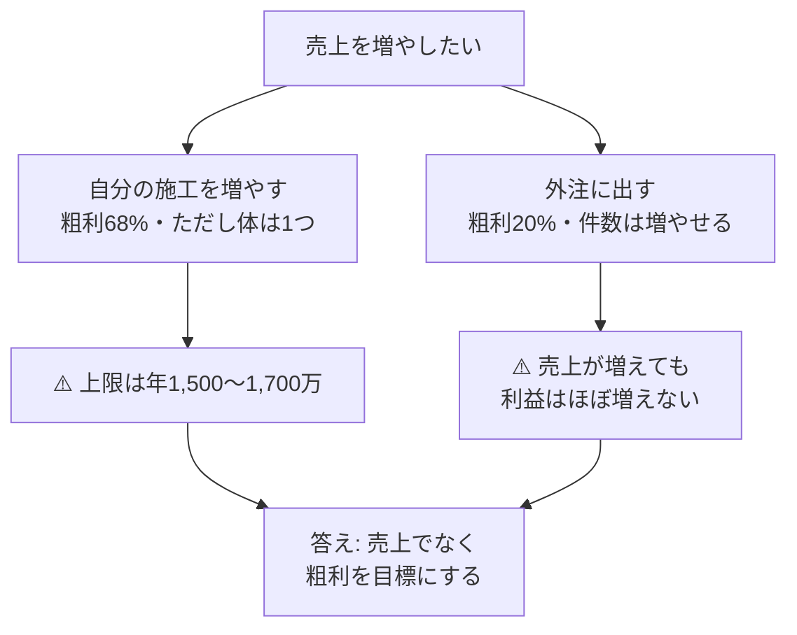
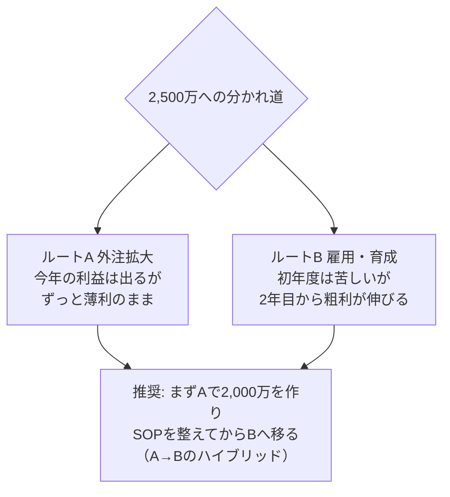

# 成長シナリオ: 売上2,000万 → 2,500万

**令和7年実績（[実績_令和7年確定申告.md](./実績_令和7年確定申告.md)）にもとづく到達シナリオとボトルネック評価。**

- 作成日: 2026-07-15
- 出発点: 売上1,510万・粗利1,022万（67.7%）・所得310万・本人1人施工

---

## 大前提: この商売の「落とし穴」を先に見る

**売上を増やす方法は2つしかない。そして利益の残り方が全く違う。**

| 方法 | 売上100万あたりの粗利 |
|---|---|
| 自分が施工する | **約68万円** |
| 外注に出す | **約20万円** |



**外注の売上1,000万円は、自分の施工300万円ぶんの粗利にしかならない。**
だから目標は「売上2,000万」ではなく「**粗利1,200万**」と読み替えて動く。

---

## ③ ボトルネック再評価（実数にもとづく）

| 順位 | ボトルネック | 数字で見た深刻さ | 効く打ち手 |
|---|---|---|---|
| 🔴 1 | **施工キャパ＝本人の体1つ** | 売上上限≒1,510万/年（月126万）。病気・ケガで売上ゼロ | SOPで外注・新人を戦力化／事務時間を施工時間へ |
| 🔴 2 | **粗利率の崖（68%→20%）** | 外注へ振るほど利益が薄まる | 直請け比率UP（単価改善）／外注ではなく育成 |
| 🟠 3 | **月次の数字が無い** | 年間合計しか分からず、打ち手の効果測定ができない（件数・単価・月別も★） | 全案件を事務サポ登録→来年は自動集計 |
| 🟠 4 | **集客の入口ゼロ** | 直請けを増やす手段が無い＝単価は元請次第のまま | LINE開設・CARE窓口・MEDIA発信 |
| 🟠 5 | **データ単一障害点** | 端末1台に全記録（変わらず） | サーバー保管移行（第3段階） |
| 🟡 6 | **経費の未内訳 約260万** | 削れる経費か固定費か判断できない | 確定申告書の内訳を実績ファイルへ追記 |

**前回監査からの変化**: 「実数が無い」は年計ベースで解消。ただし月次・件数・単価は依然★のまま（順位3へ格下げして継続）。

---

## ④-1 売上2,000万シナリオ（令和8年・2年目）

### 構成: 自分1,650万 ＋ 外注350万

| 項目 | 金額 | どうやって |
|---|---|---|
| 自分の施工 | 1,650万（月137万） | 実績126万→**+9%**。事務サポで書類時間を施工時間へ回す＋単価改善 |
| 外注に出す分 | 350万 | 繁忙期・同時進行の現場だけ。SOP-101系で品質を守る |
| **売上 計** | **2,000万** | |
| 粗利（自分 67.7%） | 1,117万 | |
| 粗利（外注 20%） | 70万 | |
| **粗利 計** | **1,187万**（率59%） | 実績+165万 |
| 経費見込み | 約750万 | 実績711万＋集客・窓口費。工具・車の一時費用が減る分と相殺 ★要月次管理 |
| **所得見込み** | **約440万** | 実績+130万 |

### 月137万は無理のない数字か

```text
実績: 月126万（事務も全部自分・集客ゼロ・創業年の段取りロスあり）
　↓ 事務サポで書類半自動化 → 月+2〜3日を施工へ
　↓ 2年目で段取り・リピートが効く
目標: 月137万（+11万・+9%） → 現実的。逆にこれ以上は体の限界に近い
```

### 2,000万到達の条件チェックリスト

- [ ] 全案件を事務サポで管理（書類時間の削減が+9%の原資）
- [ ] LINE・CARE窓口の開設（直請けの入口）
- [ ] 外注に渡せるSOP（101に加えCF・フロアタイルまで）
- [ ] 月次で「自分施工/外注/粗利」を見る（正本: 実績ファイルに毎月追記）

---

## ④-2 売上2,500万シナリオ（令和9年・3年目）

### 2つのルートの比較（ここが経営判断）

| | ルートA: 外注拡大 | ルートB: 職人1名雇用 |
|---|---|---|
| 構成 | 自分1,650万＋外注850万 | 自分1,650万＋職人850万 |
| 増える粗利 | 850万×20%＝**170万** | 850万×約55%＝約470万（材料原価のみ） |
| 増える固定費 | ほぼゼロ（出来高払い） | 人件費 約400〜450万 |
| **手元に残る差** | **+170万** | **+20〜70万（初年度）** |
| リスク | 職人不足で外注が捕まらない／品質バラつき | 仕事が薄い月も給料は出る |
| 伸びしろ | 増えない（20%のまま） | **2年目から人が育ち、売上/人が伸びる** |
| 必要な準備 | 施工SOP＋検収チェックリスト | 施工SOP＋独り立ち判定表＋教育時間 |



### 推奨シナリオ（ハイブリッド）の数字

| 項目 | 令和8年（2,000万） | 令和9年（2,500万） |
|---|---|---|
| 自分の施工 | 1,650万 | 1,650万 |
| 外注 | 350万 | 350万 |
| 職人（雇用・育成中） | — | 500万 |
| **売上** | **2,000万** | **2,500万** |
| **粗利** | **1,187万** | 約**1,462万**（1,117+70+275） |
| 人件費・経費 | 約750万 | 約1,180万（人件費+430万） |
| **所得（法人化前ベース）** | **約440万** | **約280〜350万＋育った職人という資産** |

⚠️ **正直な注意**: 3年目は雇用の先行投資で手元は一時減る。ここで折れないために2年目の+130万を貯めておく。職人が独り立ち（SOP判定表で3現場合格）した4年目から、粗利が段違いに伸びる。

### 2,500万到達の条件チェックリスト

- [ ] 施工SOPが5本以上完成し、現場検証済み
- [ ] 独り立ち判定表の運用実績がある（外注or新人で1回以上）
- [ ] 月次粗利が見えている（どんぶり勘定での雇用は禁止）
- [ ] 直請け比率の実測ができている（単価改善の余地確認）
- [ ] 採用の入口（事業計画書の採用向け章＋SOPがある会社という強み）

---

## 目標の置き方（まとめ）

| 年 | 売上 | **粗利（本当の目標）** | 体制 |
|---|---|---|---|
| 令和7年（実績） | 1,510万 | 1,022万 | 本人1人 |
| 令和8年 | 2,000万 | **1,187万** | 本人＋部分外注 |
| 令和9年 | 2,500万 | **1,462万** | 本人＋外注＋職人1名育成 |

## 関連資料

- 数字の正本 → [実績_令和7年確定申告.md](./実績_令和7年確定申告.md)
- 全体計画 → [事業計画書](../08_事業計画/事業計画書.md)（第7〜9章をこのシナリオに合わせて更新済み）
- 育成の道具 → [SOP-101 独り立ち判定表](../06_SOP/施工/SOP-101_クロス張替え.md)
