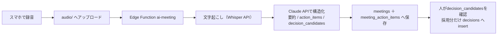

# REVO OS Supabase設計書

- 作成: 2026-07-15　対象: REVO CARE / 現場の事務サポ / SNS事業 / AI棟梁 ＋ AI Meeting / Decision Log / Dashboard
- SQLは `supabase/migrations/` に格納済み。`supabase db push` で即適用可

| ファイル | 内容 |
|---|---|
| `supabase/migrations/0001_schema.sql` | ① DB本体（テーブル・enum・索引・DB採番・タグ・組織作成RPC） |
| `supabase/migrations/0002_rls.sql` | ② RLS ＋ ③ Storageバケット・ポリシー |
| `supabase/migrations/0003_views.sql` | ⑦ KPIビュー（月次売上・粗利・顧客別利益ほか） |

## ① DB設計の要点

- **テナント＝organizations（1社1行）**。全業務テーブルが `organization_id` を持つ（RLS・100万件時のindex先頭キー）
- **事業の分離はテーブル群で行う**: CARE=`consultations` / 事務サポ=`projects`系 / SNS=`sns_posts` / AI棟梁=`learning_records`・`project_logs`
- 主キーは全てUUID。表示用案件番号は `projects.project_number`（UNIQUE (org, number)）— 現行アプリの設計をそのまま持ち込み
- **DB採番**: `issue_project_number(org, code)` が `project_counters` を原子的にインクリメント。UNIQUE制約が最終防壁（現行のWeb Locks採番を置換）
- 明細スナップショット（見積・請求の発行時点固定）は `jsonb`。集計に使う数値（total・cost_amount等）は列に分離済み
- **100万件対応**: 全一覧は `(organization_id, updated_at desc)` 複合index＋キーセットページング（`.lt('updated_at', last).limit(50)`）。`select('*')` 禁止・必要列指定
- **検索**: 日本語部分一致は `pg_trgm` GIN（projects.name / client_name / project_number, customers.name）。`ilike '%q%'` がindexに乗る
- **タグ**: `tags`（org内ユニーク）＋ `taggings`（多態: entity_type＋entity_id、PK＋entity側index）。全事業横断で同じタグ体系

## ② RLS の要点

- `auth_org()`（security definer）で自組織IDを取得 → 全テーブル「自組織のみ」full access
- `organizations` 更新と `users` 管理は owner/admin のみ（`auth_is_admin()`）
- **decisions は削除ポリシー無し＝消せない**。変更は supersede（新規行＋status変更）のみ
- 組織作成は `create_organization(name, code)` RPC 経由のみ（初回サインアップ時に呼ぶ）

## ③ Storage構成

```text
photos/     {organization_id}/{project_id}/P-001.jpg      現場写真（DB: photos.storage_path）
documents/  {organization_id}/{project_id}/REVO-26-0001-EST-01.pdf   発行済みPDF
audio/      {organization_id}/meetings/{meeting_id}.m4a   AI Meeting録音
sns-media/  {organization_id}/{post_id}/01.jpg            SNS投稿素材
```

- 全バケット非公開。**パス第1階層=organization_id** をRLSで強制（0002に実装済み）
- 表示は `createSignedUrl(path, 3600)`。公開URLは使わない

## ④ API構成

| 層 | 用途 | 実装 |
|---|---|---|
| PostgREST（supabase-js） | CRUD全般（projects/customers/invoices/…） | 追加実装不要。RLSが認可 |
| RPC | `issue_project_number` / `create_organization` | 0001に実装済み |
| KPI読み取り | `from('v_monthly_profit').select()` 等 | 0003のビュー |
| Edge Functions | 下表 | Deno・service_role |

| Edge Function | trigger | 処理 |
|---|---|---|
| `line-webhook` | LINE Messaging API webhook | 署名検証→ `consultations` にinsert（channel='line'） |
| `ai-structure` | アプリから呼出 | 既存 `/api/ai/structure-ocr`・`vision-structure` を移設（APIキーをサーバー側に隠蔽） |
| `ai-meeting` | audioアップロード後に呼出 | ⑤参照 |
| `sns-publish` | cron（毎時） | `sns_posts` の scheduled を各プラットフォームへ投稿→posted更新 |
| `import-localstorage` | 移行時1回 | 現行アプリのバックアップJSONを受けてinsert（下記⑧） |

## ⑤ AI Meeting構成



Edge Function骨子（`supabase/functions/ai-meeting/index.ts`）:

```ts
import { createClient } from "npm:@supabase/supabase-js@2";
Deno.serve(async (req) => {
  const { meeting_id, audio_path, organization_id } = await req.json();
  const db = createClient(Deno.env.get("SUPABASE_URL")!, Deno.env.get("SUPABASE_SERVICE_ROLE_KEY")!);
  const { data: audio } = await db.storage.from("audio").download(audio_path);
  const transcript = await whisper(audio);          // OpenAI Whisper API
  const ai = await claudeStructure(transcript);      // claude-sonnet-5: {summary, action_items[], decision_candidates[]}
  await db.from("meetings").update({ transcript, summary: ai.summary, ai_output: ai }).eq("id", meeting_id);
  await db.from("meeting_action_items").insert(
    ai.action_items.map((c: string) => ({ organization_id, meeting_id, content: c })));
  return new Response("ok");
});
```

## ⑥ Decision Log構成

- テーブルは0001の `decisions`。**決定は上書きしない**: 変更時は新しい行を作り、旧行を `status='superseded'`＋`superseded_by=新ID`
- 必須項目: title（何を）/ decision（どうする）/ reason（なぜ）/ alternatives（捨てた選択肢）
- `review_at` に見直し日 → `v_decisions_due` がDashboardに督促表示
- 入力経路は2つ: AI Meetingのdecision_candidatesから採用 ／ 手動insert

## ⑦ Dashboard構成

Next.js `/dashboard`（1ページ・supabase-jsでビューをselectするだけ）:

| カード | データ源 | KPI対応 |
|---|---|---|
| 月次売上・粗利の推移（12か月） | `v_monthly_profit` | S-1 / S-2 |
| 顧客別利益 Top10 | `v_customer_profit` order by gross_profit desc | A-1 / A-2 |
| 流入経路別 売上・粗利 | `v_inflow_profit` | B-2 |
| 元請別 売上・粗利 | `v_contractor_profit` | — |
| 経路別成約率 | `v_inflow_conversion` | CARE |
| 未請求案件・未入金請求 | `v_uninvoiced_projects` / `v_unpaid_invoices` | 請求もれゼロ |
| 見直し期限の来た決定 | `v_decisions_due` | Decision Log |

## ⑧ localStorage → Supabase 移行手順

1. `supabase db push`（0001→0002→0003）
2. サインアップ → `create_organization('REVO','REVO')`（既存 `genba_organization_v1` のUUIDを使う場合はservice_roleでid指定insert）
3. 現行アプリの一括バックアップJSON（案件一覧のバックアップ機能＋各キー）を `import-localstorage` へPOST：
   - `genba_projects_v1` → projects（projectId→`legacy_project_id`、UUIDはそのまま主キー）
   - `genba_work_items_v1`→work_items、`saved_estimates/invoices`→estimates/invoices、写真はbase64→`photos/`バケット
   - customers → customers（旧id→`external_key`）
4. `project_counters` を既存最大連番までseed（`insert ... select code, year, max(sequence_number)`）
5. アプリ側は `listStore.ts` の read/write を supabase-js に差し替え（設計時からこの1点交換を想定済み）

## 運用メモ（最小）

- バックアップ: SupabaseのPITR＋日次 `pg_dump`（無料枠なら週次手動でも可）
- 監視: Dashboardの `v_monthly_profit` が更新されない＝請求登録が止まっているサイン
- 拡張: 全文検索が重くなったら pgroonga、AI検索が必要になったら pgvector を追加（現設計と競合しない）
