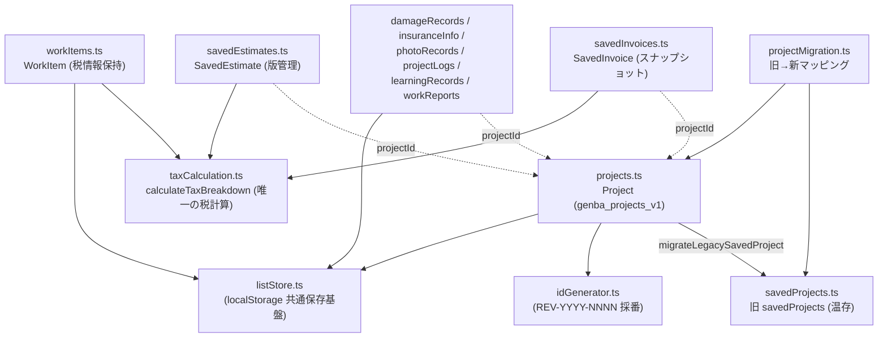

# 依存関係マップ（コード・データ・ドキュメント）

REVO OS の中核となる「現場の事務サポ」アプリの依存関係を、
(1) データ層、(2) 画面→共通部品、(3) ドキュメント間 の3層で整理する。
実際の import 関係（2026-07-15 時点のソース）から作成。

## 1. データ層の依存関係

すべての現場データは `projectId` を軸に紐付く（一案件一元管理）。

2026-07-15 追加（ユーザー別案件番号）:

- `organizations.ts` … 組織ID（UUID）。案件はユーザー個人でなく組織に紐付く（genba_organization_v1）
- `projectNumbers.ts` … 表示用案件番号の発番（{コード}-{西暦下2桁}-{連番}。カウンター: genba_project_number_counters_v1）
- 内部ID（projectId＝新規はUUID）と表示用番号（projectNumber）を分離。紐付けは内部ID、画面・PDF・書類番号は表示用番号（`projectDisplayId()`）

依存ルール:

- `listStore.ts` を土台に、案件系ストア（projects / workItems / damageRecords / insuranceInfo / photoRecords / projectLogs / learningRecords / workReports）が乗る。
- 税計算は `taxCalculation.ts` の `calculateTaxBreakdown` が唯一の実装。
  workItems / savedEstimates / savedInvoices / workItemEstimate と各PDF・画面がこれを共有し、帳票ごとの再実装は禁止
  （詳細 → [税計算仕様.md](./税計算仕様.md)）。
- 旧データ（genba_jimu_saved_projects 等）は削除せず並走。移行は `projectMigration.ts` 経由
  （詳細 → [データ移行設計.md](./データ移行設計.md)）。

## 2. 画面 → 共通部品の依存関係

| 画面 | 依存する共通部品 |
|---|---|
| /projects/[projectId]/estimate | WorkEstimatePDF, taxCalculation, savedEstimates |
| /projects/[projectId]/invoice | ProjectInvoicePDF, taxCalculation, savedInvoices |
| /projects/[projectId]/work-items | taxCalculation, TaxTotalsBox, workItems |
| /projects/[projectId]/survey | SurveyReportPDF, damageRecords |
| /projects/[projectId]/photos | PhotoLedgerPDF, photoRecords, imageCompress |
| /projects/[projectId]/reports | WorkReportPDF, workReports |
| /projects/sample/estimate ほか sample系 | EstimatePDF（旧経路A）, companySettings |
| /settings/company | companySettings（genba_settings の正本の書き手） |
| /scan | scanOcr, imagePreprocess, aiStructuring, scanDrafts |

- PDF共通部品は `src/components/pdf/PdfCommon.tsx` を土台に5帳票
  （WorkEstimatePDF / ProjectInvoicePDF / SurveyReportPDF / PhotoLedgerPDF / WorkReportPDF）が乗る。
- 会社情報の読み取りは `companySettings.ts`（getCompanyInfoForPdf / getBankSettings）に統一。
  画面から `localStorage.getItem("genba_settings")` を直接参照しない。
- 自動下書き保存は `hooks/useAutoDraft.ts` ＋ `utils/draftStorage.ts` を全入力画面で共有。

## 3. ドキュメント間の依存関係

- 本マップと各設計書は [00-master-index.md](../00-master-index.md) から参照される。
- [データ移行設計.md](./データ移行設計.md)（データ移行設計）は
  [既存機能への影響.md](./既存機能への影響.md)（既存機能影響）の前提。
- [税計算仕様.md](./税計算仕様.md) の仕様は
  [12-tax-test-result.txt](../99_保管庫/verification-2026-07-12/12-tax-test-result.txt) で検証されている。
- 検証記録（verification-2026-07-12）の証拠画像は
  [99_保管庫/pdf-samples/](../99_保管庫/pdf-samples/) に依存する。
