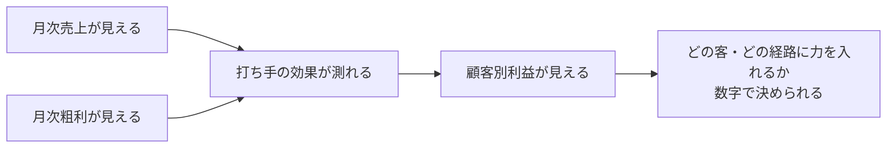

# 残タスク一覧（優先順位つきバックログ）

- 最終更新: 2026-07-15（案件ID自動発番の承認にともない全面再整理）
- **前提（経営者決定）: 事務サポの最重要KPIは「案件数」ではなく「月次売上・月次粗利・顧客別利益」**
- 運用ルール: S→A→Bの順に着手。完了したら行頭に ✅ を付け、このファイルを更新する

## 優先順位の考え方

案件を増やす機能より先に、**「儲かっているか」が毎月見える状態**を作る。
（自動化ロードマップ第3-a段階「月次の数字の見える化」と同じ方針）

---

## S級（最優先: KPIを見える化する）

| # | タスク | 内容・実現手段 |
|---|---|---|
| S-1 | **月次売上集計** | 保存済み請求（SavedInvoice）から月別売上を自動集計する画面。請求日ベース |
| S-2 | **月次粗利集計** | 工事項目（WorkItem）が売価と原価（costAmount）を既に持っているため、案件別粗利→月別粗利を自動算出できる |
| S-0 | **（基盤・並行必須）データのサーバー保管移行** | KPIの元データが端末1台の中にある限り、端末故障で集計ごと消える。S-1/S-2と並行で進める（ロードマップ第3-b） |

## A級（KPIの精度と顧客軸を作る）

| # | タスク | 内容・備考 |
|---|---|---|
| A-1 | **顧客別売上集計** | Project.customerId は実装済み・保存経路も接続済み。customerIdで案件→請求を束ねるだけ |
| A-2 | **顧客別粗利集計** | 同上（WorkItemの原価から） |
| A-3 | **顧客詳細画面** | 顧客マスタ（customers）に案件履歴・売上・粗利を表示する画面 |
| A-4 | **Supabase移行時のorganization_id焼き込み** | 見積・請求・写真等はprojectId経由の間接紐付けのため、移行スクリプトでJOINして各テーブルへorganization_idを付与（RLS用）。Customerマスタへのorganization_id付与とIDのUUID化（またはexternal_key温存）もここで実施 |
| A-5 | 一括請求の案件連携＋単体・一括フローの税区分対応 | **月次売上・粗利集計の漏れ防止**（案件に紐付かない請求はKPIから漏れる）。旧TODOをKPI理由でA級へ昇格 |

## B級（顧客軸を深くする・記録を貯める）

| # | タスク | 内容・備考 |
|---|---|---|
| B-1 | **顧客ID正式実装** | 顧客マスタの整備（UUID化・重複統合・全案件へのcustomerId補完） |
| B-2 | **紹介元管理** | 流入経路（inflowRoute/inflowSourceName）は保存済み。紹介元・経路別の件数・売上一覧化 |
| B-3 | **顧客ランク機能** | 顧客別利益（A-1/A-2）が貯まってから。利益ベースでランク付け |
| B-4 | AI棟梁の入力画面（案件ログ・学び） | 型・保存層は実装済み（learningRecords/projectLogs）。顧客別利益の「なぜ」を説明する記録。ロードマップ第4段階 |
| B-5 | 写真保存のIndexedDB移行 | localStorage約5MB上限対策。多枚数運用が始まる前に |

## C級（便利機能・整理系。KPIに直結しない）

- 案件請求の支払期限入力欄（現状PDFは「別途ご相談」表示）
- 見積の版の差分表示・削除UI（過去版は保持のみ）
- 分割請求（複数回請求）の版管理
- 旧見積画面（sample/estimate・経路A）の実値化または整理
- 会社設定readの完全共通化（settings/company の直接読みをgetCompanySettings経由へ）
- 音声入力（ロードマップ第4段階）・AI棟梁提案（第5段階）・保険書類自動化（第6段階）

## 済（完了済み）

- ✅ ユーザー別案件ID自動発番（内部UUID＋表示用番号・組織ID・流入経路・一覧検索/コピー・既存案件一括付与）— 2026-07-15承認
- ✅ localStorage採番の複数タブ課題への当面対策（Web Locks＋自己修復。恒久対応はS-0のDB採番）

---

## 参考: 2026-07-12時点の詳細メモ（原文・当時の記録）

> 統合修正 — 残TODO
>
> ■ 準備中（型・保存層は実装済み、入力画面のみ未実装）
> - 08 案件ログ（projectLogs.ts 実装済み）… /projects/[projectId]/logs は準備中ページ
> - 09 学び（learningRecords.ts 実装済み）… /projects/[projectId]/learning は準備中ページ
>
> ■ 見積・請求の発展余地
> - 版管理は簡易版（REV-...-EST-01 / -INV-01）。改訂で版番号を増やす完全な履歴管理は未実装。
> - 案件請求のお支払期限は空（PDFは「別途ご相談」表示）。入力欄の追加余地あり。
> - 案件見積画面は WorkItem の閲覧＋保存＋PDF。明細の直接編集は「04 工事項目・原価」で行う設計。
> - 一括請求（sample/invoice）は projectId 連携未対応（元請単位のデモ主体のまま）。
>   個別請求は案件連携済み。一括請求の案件連携は次段階。
>
> ■ 既存見積画面（sample/estimate）
> - 経路A（案件未選択の手入力）として残置。見積番号・作成日は従来サンプル値のまま。
> - getSelectedEstimateId を読み込まない既存の不完全導線（register→estimate）は本タスク範囲外。
>
> ■ 会社設定
> - settings/company の read は自キー直接（正本の書き手のため）。完全共通化の余地あり。
>
> ■ 複数タブ/端末
> - localStorage 採番のため複数端末・同時編集には未対応（→2026-07-15にWeb Locks＋自己修復で当面対策済み。恒久対応はSupabase移行時のDB採番）。
>
> ■ 写真保存
> - 圧縮済みでも localStorage 約5MB 上限。多枚数運用時は IndexedDB 移行が必要。
>
> ■ 将来スコープ
> - Supabase接続 / ログイン / 権限 / 音声認識API / 保険会社API / 経営ダッシュボード
>
> ■ 税区分・税率対応で残したTODO
> - 単体見積（/projects/sample/estimate）・単体請求・一括請求は課税10%固定のまま。
>   案件フロー（WorkItem＋calculateTaxBreakdown）は対応済み。単体・一括の税区分対応は次段階。
>
> ■ マージ前最終修正で残したTODO
> - ステータス自動更新は主要工程のみ（approved/scheduled/completed/paidは手動）。
> - 見積版管理は線形履歴のみ。版の削除UI・差分表示は未実装。
> - 請求書は案件あたり1件（スナップショットで発行時点を固定）。分割請求は次段階。
> - PDF目視は主要3帳票のみ実施。残りは生成成功（%PDF検証）まで。
