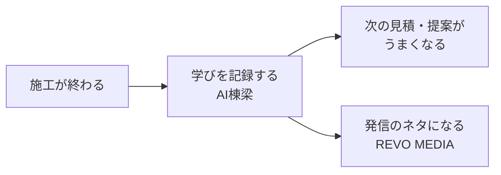

# 05_AI棟梁（知識蓄積）

**会社の記憶。ベテランの頭の中を、会社の財産に変える仕組み。**

## 現在の状態: 🟠 器は完成・入力画面はこれから

大事なこと: **AI棟梁は事務サポと別のシステムではありません。**
事務サポの中に、記録をしまう「器」（データの入れ物）がすでに作られています。

| 器の名前 | 何を貯めるか | 実装場所（アプリ内） |
|---|---|---|
| 学び・振り返りの記録 | うまくいったこと／失敗／想定外の問題（1案件1件） | `src/app/utils/learningRecords.ts` |
| 案件ログ | 保険会社・元請・施主とのやり取りの時系列記録 | `src/app/utils/projectLogs.ts` |

いま足りないのは**入力する画面**だけです（`/projects/[案件番号]/learning` と `/logs` は準備中ページ）。
詳細は [04_事務サポ/残タスク一覧.md](../04_事務サポ/残タスク一覧.md) に明記されています。

## 記録が流れていく先

## これから入れるもの

- 記録の書き方ルール（何を・いつ・どのくらい書くか）
- 貯まった学びのまとめ（月ごと）

## 関連資料

- 計画の全体像 → [事業計画書 第5章](../08_事業計画/事業計画書.md#第5章-各システムの役割)
- 器の設計 → [04_事務サポ/依存関係マップ.md](../04_事務サポ/依存関係マップ.md)
