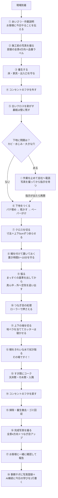
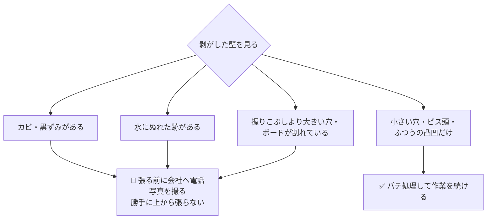
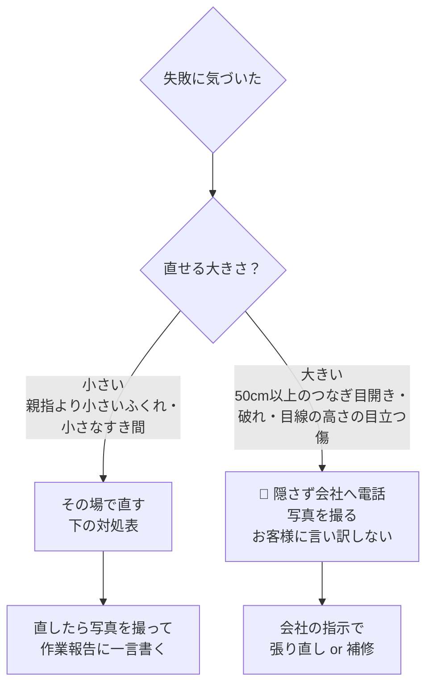

# SOP-101 クロス張替え（正本）

**目的: 新人職人が1人で現場へ行き、ベテランと同じ品質で張替えができること。**

| 項目 | 内容 |
|---|---|
| 対象作業 | 居室・廊下などの壁・天井クロスの張替え |
| 対象者 | 新人（研修中はベテラン同行。独り立ち判定は本書の最後） |
| 持ち出し版 | 印刷して現場へ → [SOP-101_現場チェックリスト.md](./SOP-101_現場チェックリスト.md) |
| 版 | 2026-07-15 初版（直すときはこのファイルを直す。正本はここ） |

---

## 全体フローチャート（1日の流れ）



---

## ① 必要な道具（出発前チェック）

| ✅ | 道具 | 何に使う |
|---|---|---|
| ☐ | カッター＋替刃たくさん | 刃はケチらない。**1面張るごとに折る** |
| ☐ | 地ベラ | 端を切るときの定規になる板 |
| ☐ | 撫でバケ | 空気を追い出すブラシ |
| ☐ | ジョイントローラー | つなぎ目を押さえるコロコロ |
| ☐ | 竹ベラ | 角に折り目をつける |
| ☐ | パテベラ＋パテ板 | 壁の穴を埋める |
| ☐ | サンドペーパー（中目） | パテを平らに削る |
| ☐ | スポンジ＋バケツ | 糊を拭く。**水は現場で借りず持参** |
| ☐ | メジャー | 寸法を測る |
| ☐ | 脚立 | 天井際の作業 |
| ☐ | 養生シート・マスカー・養生テープ | 床と家具を守る |
| ☐ | ドライバー（＋と−） | コンセントのフタの取り外し |
| ☐ | 掃除機・ほうき・ゴミ袋 | 帰る前の掃除 |
| ☐ | スマホ（充電OK） | 写真と連絡 |

## ② 必要な材料（出発前チェック)

| ✅ | 材料 | 確認すること |
|---|---|---|
| ☐ | クロス本体 | **品番・色・ロット番号が注文書と同じか**（ロットが違うと色が微妙に違う） |
| ☐ | クロスの量 | 足りるか下の式で計算 |
| ☐ | 糊（または生のり付きクロス） | 量は足りるか |
| ☐ | パテ（下用・仕上げ用） | |
| ☐ | ジョイントコーク | クロスと同系色 |

**クロスの量の計算（覚え方）**

```text
必要な長さ(m) ＝ 壁の横幅の合計(m) ÷ 0.9(クロスの有効幅) × 天井までの高さ(m)
             ＋ 全体の1割ましのゆとり
例: 6畳の部屋（周囲約15m・高さ2.4m）→ 15÷0.9≒17列は不要、
    実際は柄合わせ分も見て「注文書の数量」を信じる。
    現場で足りない！が最悪。出発前に注文書と現物を必ず照合。
```

## ③ 施工前確認（現場に着いたら）

- [ ] お客様にあいさつ「本日クロスの張替えに来ましたREVOの〇〇です」
- [ ] 今日やる部屋・範囲をお客様と指差し確認（**思い込みで隣の部屋をやらない**）
- [ ] 施工前の写真を撮る（→ 写真撮影箇所の表）
- [ ] 家具の移動（お客様の物は**勝手に触らず一声かける**）
- [ ] 床・残す家具・出入口を養生
- [ ] ブレーカーの場所を確認 → コンセント・スイッチのフタを外す
- [ ] 下地の状態チェック（下の分岐図）



**なぜ止めるの？** カビや水じみの上に張ると、**数か月後に浮いてきてやり直し**になり、お客様の信頼を失うから。止める判断は失敗ではなく、正しい仕事。

## ④ 施工手順（コツの図解）

### 手順の順番は冒頭のフローチャートのとおり。ここでは失敗しやすい4か所だけ図解する。

**コツ1: 張り始めはまっすぐの基準線から**

```text
壁は曲がっていることがある。ドア枠や柱を信じない。
1列目の位置に、必ず「垂直の線」を出してから張る。
（下げ振りかレーザーで。1列目が曲がると全部曲がる）

 天井 ───────────────
      |←1列目→|
      |   ↑   |
      |  この線が命  |
 床  ───────────────
```

**コツ2: 空気の追い出しは「真ん中から外へ」**

```text
おにぎりをラップで包むときと同じ。
真ん中を押さえてから、外へ外へ空気を逃がす。

        ↑上へ
   ←   ●   →      ● = 撫でバケを当てる順番は
        ↓下へ          真ん中 → 上下 → 左右
```

**コツ3: 端を切るときは「地ベラ＋寝かせたカッター」**

```text
 ✕ ダメ: カッターを立てる → 下地まで切れて跡が出る
 ○ 良い: 地ベラをグッと押し当て、カッターの刃を
         壁とほぼ平行に寝かせて、地ベラに沿わせて切る。
         刃は1面ごとに折って新しくする。
```

**コツ4: 糊の「置き時間」を守る**

| 糊を付けてから | 状態 | 張っていい？ |
|---|---|---|
| すぐ | 糊がなじんでいない・紙が伸び切っていない | ✕ つなぎ目が後で開く |
| **5〜10分** | 紙が糊を吸って落ち着いている | ○ ここで張る |
| 30分以上 | 乾き始めている | ✕ くっつかない |

## ⑤ 施工後確認

- [ ] 糊の拭き残しゼロ（**手のひらで触ってペタペタしない**）
- [ ] コンセント・スイッチのフタを全部戻した（ネジ締め確認）
- [ ] 養生を全部はがした（テープの糊残りも確認）
- [ ] 掃除機をかけた・ゴミは全部自分の袋に入れた（**現場にゴミを残さない**）
- [ ] 借りた物・動かした家具を元の位置へ
- [ ] 完成写真を撮った（→ 次の表）

## ⑥ 写真撮影箇所（事務サポの写真台帳に登録する）

| タイミング | 撮るもの | 枚数の目安 | なぜ撮る |
|---|---|---|---|
| 施工前 | 部屋の全景（東西南北の4方向） | 4枚 | 「元の状態」の証拠 |
| 施工前 | クロスの品番ラベル | 1枚 | 品番間違いの防止・証拠 |
| 施工前 | 下地の不具合（あれば） | 見つけた数だけ | 会社への報告・保険用 |
| 施工中 | 剥がした後の下地全体 | 2枚 | 下地の状態の証拠 |
| 施工中 | パテ処理が終わった状態 | 2枚 | 手抜きしていない証拠 |
| 施工後 | 部屋の全景（同じ4方向から） | 4枚 | 前後比較ができる |
| 施工後 | つなぎ目のアップ・入隅 | 2〜3枚 | 品質の証拠 |

**撮り方のルール: 施工前と施工後は「同じ場所に立って・同じ向きで」撮る。** 比べられる写真が一番強い証拠になる。

## ⑦ よくある失敗（先輩たちが実際にやった失敗）

| # | 失敗 | 原因 |
|---|---|---|
| 1 | つなぎ目が開く・目立つ | 置き時間を守らなかった／ローラーがけを忘れた |
| 2 | 空気のふくらみが残る | 真ん中から外へ、をやらず端から張った |
| 3 | 数日後に糊の跡がテカる・変色 | その場で水拭きしなかった |
| 4 | 端がガタガタ・下地まで切った | 刃が古い／カッターを立てて切った |
| 5 | 柄がズレた | 柄物なのに柄合わせ分の余裕を取らずに切った |
| 6 | 1列目から全部ななめ | 基準線を出さずにドア枠に合わせた |
| 7 | 材料が足りない | 出発前に注文書と現物を照合しなかった |
| 8 | 隣の部屋・違う壁をやった | 最初にお客様と指差し確認しなかった |

## ⑧ 失敗した時の対処



| 症状 | その場の直し方 |
|---|---|
| 小さいふくれ | 針で小さく穴 → 空気を押し出す → ローラー。糊切れなら注射器で糊を入れる |
| 乾く前のつなぎ目のすき間 | 両側から寄せて撫で直し → ローラー |
| 乾いた後の細いすき間 | 同系色のジョイントコークをうすく入れて指でならす |
| 糊が付いた | **すぐ**きれいな水で拭く（時間がたつほど取れない） |
| 小さい破れ・傷 | 残ったクロスで柄を合わせて当て張り補修 |

**一番大事なルール: 失敗は隠した瞬間に「事故」になる。電話1本で「相談」で済む。**

## ⑨ 品質チェック（完了判定基準）

**全部○になったら完成。1つでも✕なら直してから帰る。**

| ✅ | チェック | 合格の基準 |
|---|---|---|
| ☐ | つなぎ目チェック | **1m離れて見て、つなぎ目がどこか分からない** |
| ☐ | 光当てチェック | 照明・窓の光を**ななめから**当てて、ふくれ・凸凹が見えない |
| ☐ | さわりチェック | 手のひらで撫でて、ベタつき・浮きがない |
| ☐ | 端部チェック | 天井際・巾木際が一直線。すき間はコークで埋まっている |
| ☐ | 角チェック | 入隅・出隅が浮いていない |
| ☐ | 復旧チェック | コンセントのフタ全部復旧・家具を元どおり |
| ☐ | 清掃チェック | ゴミゼロ・糊はねゼロ・養生撤去済み |
| ☐ | 写真チェック | 施工前後の写真が同じ向きで揃っている |

## ⑩ お客様へ報告する内容（そのまま言えばOKの台本）

1. 「作業が終わりました。**一緒にご確認をお願いします**」（必ず一緒に見る）
2. つなぎ目・角・仕上がりを一緒に見てもらう
3. **乾くまでの説明**: 「糊が乾くまで2〜3日、ところどころ少しふくらんで見えることがありますが、**乾くと自然に消えます**。1週間たっても消えない場合はご連絡ください」
4. 「しばらく換気をしていただくときれいに乾きます」
5. 「ゴミはすべてお持ち帰りしました」
6. 連絡先（会社の電話番号）を伝えて、あいさつして退出

---

## ベテラン確認ポイント（独り立ち判定表）

新人が1人で現場に行けるかは、**ベテランがこの表で3現場ぶん確認**して決める。

| 確認ポイント | 見るところ | 1現場目 | 2現場目 | 3現場目 |
|---|---|---|---|---|
| 下地の判断 | カビ・水じみで正しく手を止めて電話できたか／パテの平らさ | ☐ | ☐ | ☐ |
| 基準線 | 1列目の前に垂直を出したか | ☐ | ☐ | ☐ |
| 置き時間 | 糊付け後5〜10分を守ったか（せっかちになっていないか） | ☐ | ☐ | ☐ |
| つなぎ目 | 1m離れて分からないか／ローラー忘れがないか | ☐ | ☐ | ☐ |
| 刃の管理 | 面ごとに刃を折っているか | ☐ | ☐ | ☐ |
| 端の始末 | 地ベラ＋寝かせ切りができているか | ☐ | ☐ | ☐ |
| 糊拭き | その場拭きが習慣になっているか | ☐ | ☐ | ☐ |
| お客様対応 | あいさつ・指差し確認・完了報告の台本が言えるか | ☐ | ☐ | ☐ |
| 写真 | 前後同アングルで撮れて、事務サポに登録できるか | ☐ | ☐ | ☐ |
| 記録 | AI棟梁に学びを書いたか | ☐ | ☐ | ☐ |

**判定: 3現場連続で全項目☑ → 独り立ちOK（ベテランのサイン: ＿＿＿＿ 日付: ＿＿＿＿）**

---

## 終わったら必ず（REVO OSへの接続）

1. 写真を**事務サポの写真台帳**に登録する（案件番号にひもづける）
2. **AI棟梁**に今日の学びを1行以上書く（うまくいったこと・失敗・想定外）
3. 作業報告書を事務サポから発行する

## 関連資料

- 現場持ち出し版（印刷用1枚） → [SOP-101_現場チェックリスト.md](./SOP-101_現場チェックリスト.md)
- 学びの書き方 → [05_AI棟梁](../../05_AI棟梁/README.md)
- SOP全体のルール → [06_SOPのREADME](../README.md)
