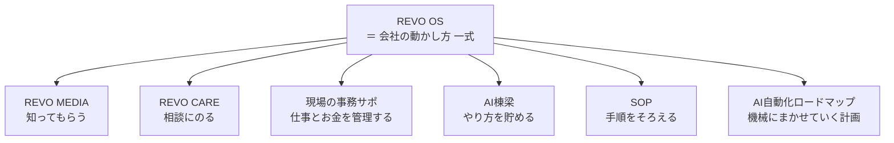
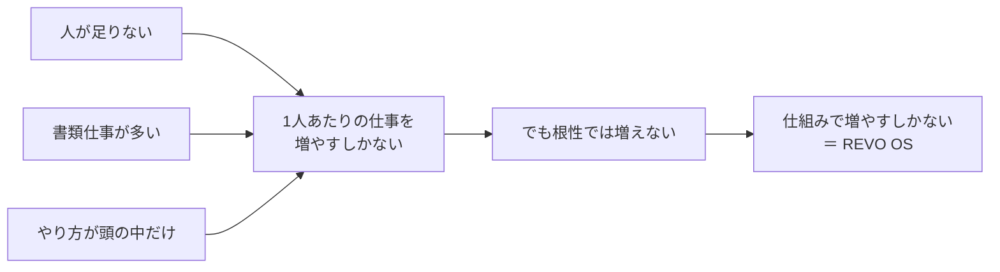
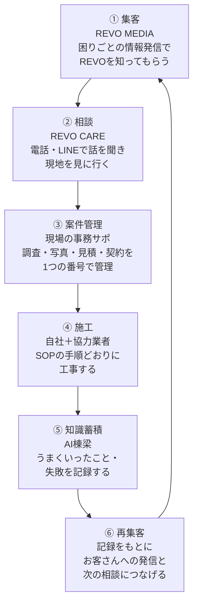
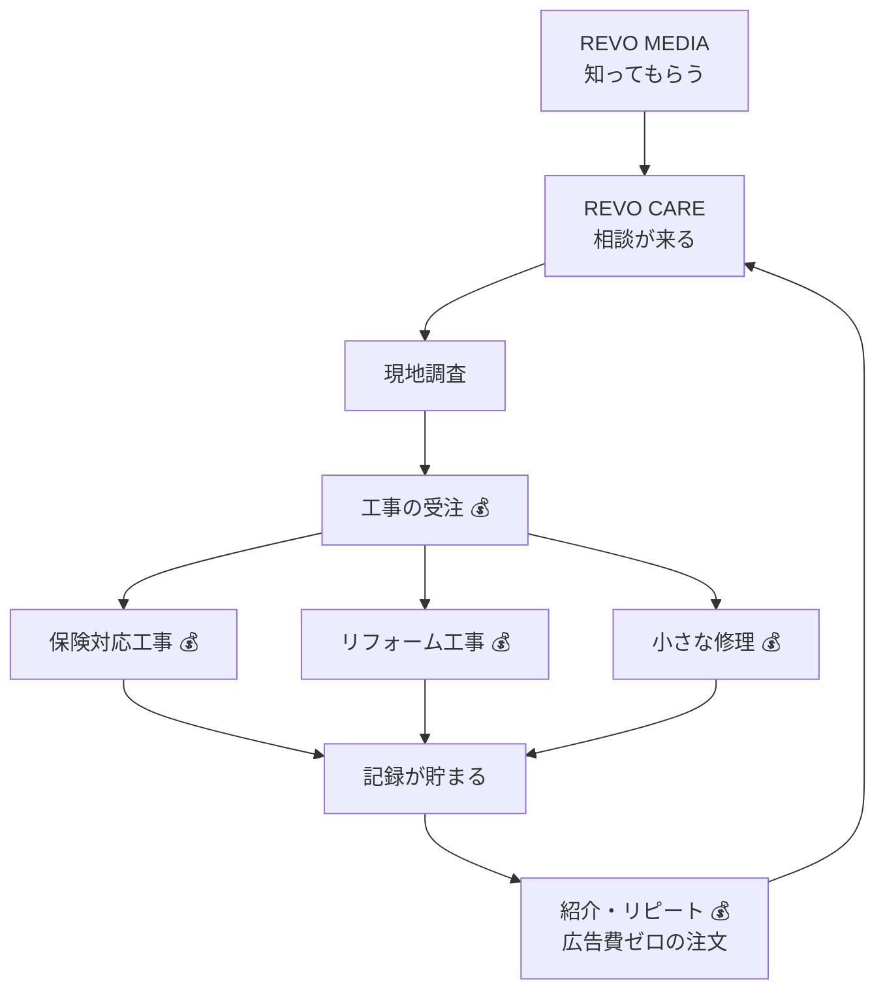
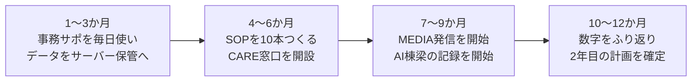
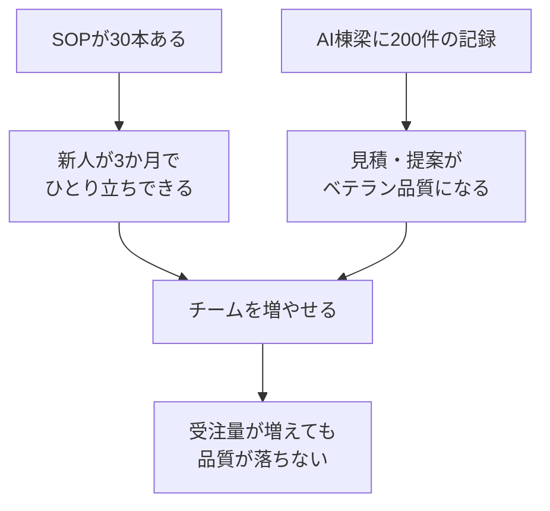
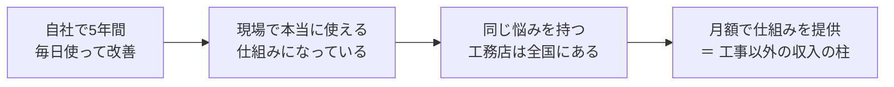
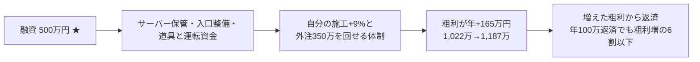
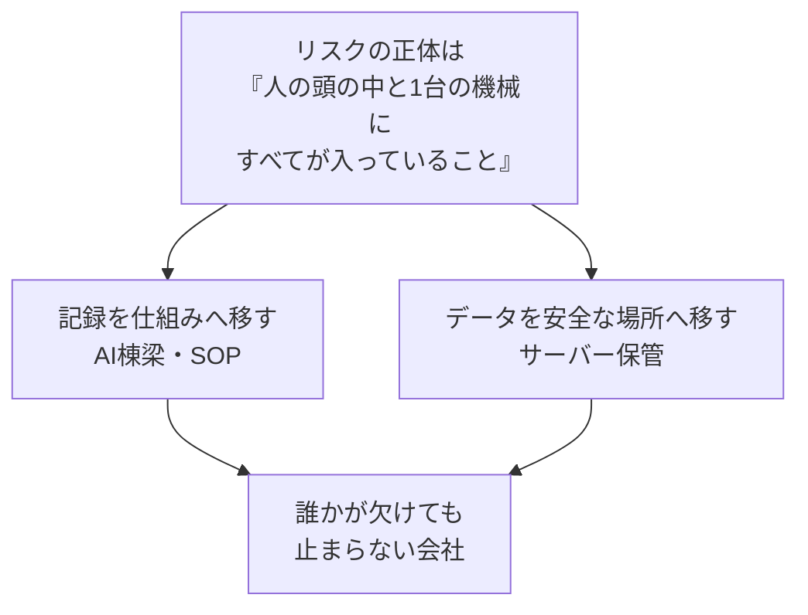
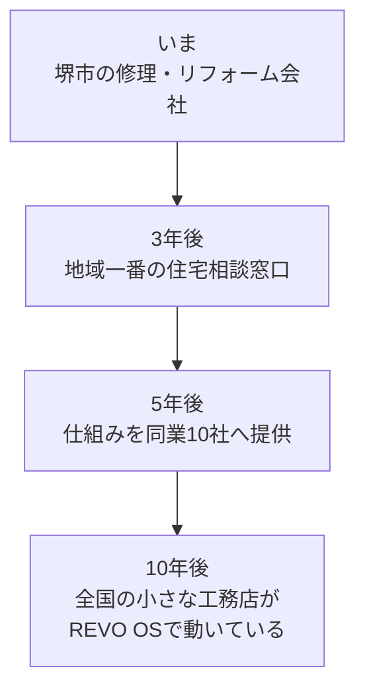

# REVO OS 事業計画書

**REVO の仕事のやり方を、ひとつの「仕組み」にする計画**

- 作成日: 2026-07-15（第2版: 同日、令和7年確定申告の実績を反映）
- 作成: REVO（大阪府堺市／住宅の修理・リフォーム業）
- 版: 第2版

> **お金の数字について**
> 売上・粗利・所得などの土台の数字は、**令和7年（創業年）の確定申告の実績**にもとづいています。
> 数字の正本 → [01_経営/実績_令和7年確定申告.md](../01_経営/実績_令和7年確定申告.md)
> まだ実測が無い数字（月別売上・件数・平均単価・事務時間など）には ★ 印を残しています。
> ★は事務サポへの全案件登録が進めば来年から実数になります。

---

## この資料の使い方（誰が・どこを読むか）

| 読む人 | 目的 | 特に読む章 |
|---|---|---|
| ① 銀行の担当者 | 融資の判断 | 第2・3・6・7・10・11章 |
| ② 補助金の審査員 | 申請内容の確認 | 第2・3・5・7・10章 |
| ③ 協力業者（職人さん） | 一緒に働くイメージ | 第4・5・12章 |
| ④ 働きたい人（採用） | 会社の将来性 | 第1・4・8・12章 |
| ⑤ 将来の投資家 | 成長性の判断 | 第6・8・9・12章 |
| ⑥ 自社（経営方針の共有） | 全員で同じ地図を持つ | 全章 |

---

# 第1章 REVO OSとは

## ひとことで言うと

**「家の困りごとを解決する仕事を、最初から最後まで、忘れずに・速く・同じ品質でやるための、REVOの仕組み一式」** です。

OSとは「オペレーティング・システム」の略ですが、むずかしく考えなくて大丈夫です。
**「会社の体の動かし方そのもの」** という意味で使っています。

## たとえ話：ラーメン屋さんで考える

| ラーメン屋さん | REVO OS では |
|---|---|
| お店の看板・チラシ | REVO MEDIA（お客さんに知ってもらう） |
| 注文を聞く店員さん | REVO CARE（困りごとの相談窓口） |
| 注文票・レジ | 現場の事務サポ（仕事の記録・お金の計算） |
| 秘伝のレシピノート | AI棟梁（うまくいったやり方を貯める） |
| 調理マニュアル | SOP（誰がやっても同じ味になる手順書） |
| 新しい調理機械の導入計画 | AI自動化ロードマップ（機械にまかせる計画） |

**大事なこと：これらは6つの別々の事業ではありません。**
1杯のラーメンを出すためにお店の全部が連動するのと同じで、
**「1軒の家の困りごとを解決する」という1つの仕事のために、6つの部品が連動する、1つのシステム**です。

## REVO OSの6つの部品

このうち **「現場の事務サポ」はすでに動いています**（このリポジトリに入っているアプリ本体）。
絵に描いた計画ではなく、**中心部分がもう完成して動いている**ことが、この計画のいちばんの強みです。

---

# 第2章 現状の住宅業界の課題

## 家を直す仕事の現場で、いま起きていること

| 課題 | 具体的に何が困るか |
|---|---|
| ① 職人さんが足りない | 直したい家はあるのに、直せる人がいない |
| ② 事務仕事が多すぎる | 見積書・請求書・写真の整理・保険の書類…夜まで書類づくり |
| ③ やり方が人の頭の中にしかない | ベテランが辞めると、やり方ごと消えてしまう |
| ④ お客さんがどこに相談していいか分からない | 「雨もりした。誰に電話すればいいの？」で困る |
| ⑤ 頼まれた仕事を忘れる・遅れる | メモがバラバラで、抜けもれが起きる |

## 数字で見る業界の背景 ★

| 項目 | 状況 |
|---|---|
| 建設業で働く人の年齢 | 高齢の方の割合が年々増えている ★（公的統計に差し替え） |
| 家の平均年齢 | 古い家が増え、修理の需要は増え続ける ★ |
| 1人あたりの事務時間 | 現場仕事と同じくらい書類仕事に時間がかかっている ★（自社実測に差し替え） |

## 課題の本当の正体

**「人を増やす」のではなく「同じ人数でできる量を、仕組みで増やす」。** これがこの計画の出発点です。

---

# 第3章 REVO OSが解決する問題

第2章の課題①〜⑤に、REVO OSの部品が1対1で対応します。

| 業界の課題 | REVO OSの答え | どう解決するか |
|---|---|---|
| ① 職人不足 | SOP ＋ AI自動化 | 手順書と自動化で、経験が浅い人でも戦力になる |
| ② 事務が多い | 現場の事務サポ | 写真を撮る→見積・請求・報告書が半自動でできる |
| ③ やり方が頭の中 | AI棟梁 | 現場のコツ・失敗・成功を記録して、会社の財産にする |
| ④ 相談先が不明 | REVO CARE | 「まずここに電話すれば大丈夫」という窓口をつくる |
| ⑤ 忘れる・遅れる | 現場の事務サポ | 1つの案件番号に全部ひもづくので、抜けもれが見える |

## すでに動いている証拠

「現場の事務サポ」では、次のことが**実際に動作確認済み**です（根拠資料は巻末の一覧を参照）。

- 案件を1つの番号（REV-2026-〇〇〇〇）で登録し、調査 → 写真 → 見積 → 請求まで1本の流れで管理できる
- 見積書・請求書・調査報告書・写真台帳・作業報告書の**5種類の書類がボタン1つでPDFになる**
- 消費税の計算（10%・8%・非課税の混在）を**1か所の計算式で正確に**処理する
- 保険を使う工事（雨もり等）の専用の流れがある

---

# 第4章 事業全体フローチャート

REVO OSの仕事は一直線ではなく、**ぐるぐる回る輪**です。1周まわるたびに会社が賢くなります。

## 輪が1周すると何が起きるか

| 周回 | 起きること |
|---|---|
| 1周目 | ふつうに工事が1件終わる |
| 2周目 | 前回の記録があるので、見積が速く・正確になる |
| 10周目 | 「この症状ならこの直し方」というパターンが貯まる |
| 100周目 | 新人でもベテランと同じ提案ができる。発信のネタも100件分ある |

**工事を1件やるたびに、会社の「頭」と「集客のタネ」が増える。** これがこの輪のいちばんの価値です。

---

# 第5章 各システムの役割

## 5-1 REVO CARE（住宅相談窓口）

- **役割**: 「家のことで困ったら、まずREVOに電話」という**入り口**になる
- **やること**: 電話・LINEでの相談受付 → 症状の聞き取り → 現地調査の予約
- **ポイント**: 売り込みではなく「相談」から始まるので、お客さんが安心して連絡できる

## 5-2 REVO MEDIA（集客）

- **役割**: REVOを**知ってもらう**
- **やること**: 施工事例・家の困りごと解決法の発信（ホームページ・SNS・チラシ）
- **ポイント**: ネタはAI棟梁に貯まった**本物の現場記録**。作り話ではないから信頼される

## 5-3 現場の事務サポ（案件管理）※すでに稼働中

- **役割**: 仕事とお金の**背骨**。相談から入金まで全部を1つの番号で管理
- **やること**:

- **できること（動作確認済み）**:

| 機能 | 内容 |
|---|---|
| 案件の一元管理 | 1案件＝1番号。調査・写真・見積・請求が全部ひもづく |
| 書類の自動作成 | 5種類の書類がボタン1つでPDFに |
| 正確な税計算 | 10%・8%・非課税が混ざっても1つの計算式で正確 |
| 保険工事対応 | 保険会社へ出す書類の流れを専用で用意 |
| 紙の読み取り | 紙の見積書を写真に撮ると、AIが内容を読み取って整理 |
| 消えない工夫 | 入力途中でも自動で下書き保存 |

## 5-4 AI棟梁（知識蓄積）

- **役割**: 会社の**記憶**。ベテランの頭の中を、会社の財産に変える
- **やること**: 工事のたびに「症状 → 原因 → 直し方 → かかった費用 → 学び」を記録
- **現在地**: 記録の器（案件ログ・学びの記録）は事務サポ内に**設計済み**。入力画面は次の開発段階
- **将来**: 貯まった記録をAIが検索して「この症状なら、過去のこの3件が参考になります」と教えてくれる

## 5-5 SOP（標準化）

- **役割**: 会社の**マニュアル**。「誰がやっても同じ品質」をつくる
- **やること**: 調査のやり方・写真の撮り方・見積のつくり方・道具の使い方を手順書にする
- **現在地**: 開発作業の手順書（コマンド一覧）が第1号としてすでに存在。同じ形式で現場作業へ広げる

## 5-6 AI自動化ロードマップ

- **役割**: 「人がやらなくていい仕事」を順番に機械へ渡していく**計画表**
- **正本はこちら** → [07_自動化/README.md](../07_自動化/README.md)（下の表は説明用の写し。更新は正本を先に直す）

| 段階 | 自動化すること | 時期 |
|---|---|---|
| 第1段階（済） | 書類づくり（見積・請求・報告書のPDF化） | 完了 |
| 第2段階（済） | 紙の書類の読み取り（写真→AIが整理） | 完了 |
| 第3-a段階 | **月次の数字の見える化**（月別売上・粗利の自動集計） | 令和8年上期・最優先 |
| 第3-b段階 | データを端末1台から、安全なサーバー保管へ | 令和8年上期 |
| 第4段階 | AI棟梁の入力画面＋音声入力 | 令和8年下期〜令和9年 |
| 第5段階 | AI棟梁による提案（過去事例から直し方を提示） | 令和9年 |
| 第6段階 | 保険書類の自動作成・経営数字の自動集計 | 令和9〜10年 |

---

# 第6章 収益モデル

## お金が入ってくる流れ

**いまの収益の柱は「工事の売上」です。** REVO OSは商品そのものではなく、
**同じ人数で受けられる工事の数を増やし、1件あたりの手間を減らす「稼ぐ力の土台」**です。

## 実績と目標（令和7年 確定申告の実数）

| 項目 | 令和7年 実績 | 令和8年 目標 |
|---|---|---|
| 売上 | **1,510万円**（月平均126万円） | **2,000万円**（自分1,650万＋外注350万） |
| 粗利 | **1,022万円（67.7%）** | 1,187万円 |
| 事業所得 | **310万円（20.5%）** | 約440万円 |
| 体制 | 職人本人1人が施工 | 本人＋繁忙期のみ外注 |

### この商売でいちばん大事な数字（粗利の崖）

| 売上100万円を… | 手元に残る粗利 |
|---|---|
| 自分が施工する | **約68万円** |
| 外注に出す | **約20万円** |

**だから目標は「売上」ではなく「粗利」で立てる。** 売上2,000万・2,500万への具体的な道すじと計算は
→ [01_経営/成長シナリオ_2000万2500万.md](../01_経営/成長シナリオ_2000万2500万.md)（正本）

月の相談件数・成約率・平均単価は ★実測がまだ無い。事務サポの全案件登録で来年から自動集計する。

## REVO OSが効く場所

| 数字 | OSなし | OSあり | 理由 |
|---|---|---|---|
| 1件あたりの事務時間 | 約8時間 ★ | 約2時間 ★ | 書類が半自動でできる |
| 見積の提出スピード | 3〜7日 ★ | 当日〜翌日 ★ | 現場で写真→そのまま見積 |
| 月にさばける件数 | 5件 ★ | 8〜10件 ★ | 浮いた時間で工事を増やす |
| 紹介・リピート率 | 記録なしで不明 | 記録して伸ばす | AI棟梁でお客さんごとの履歴が残る |

**将来の追加収益（第12章参照）**: 貯まったSOPと仕組みそのものを、同業の工務店へ提供する道があります。

---

# 第7章 1年計画

## テーマ：**土台を固める**

## やることリスト

| 時期 | やること | できたかの判定 ★ |
|---|---|---|
| 1〜3か月 | 全案件を事務サポで管理する | 新規案件の100%を登録 |
| 1〜3か月 | データを安全なサーバー保管に切り替える | 1台のパソコンが壊れてもデータが残る状態 |
| 4〜6か月 | 現場SOPを10本つくる | 調査・写真・見積など主要作業の手順書化 |
| 4〜6か月 | REVO CARE窓口（電話・LINE）を開設 | 月5件の相談受付 ★ |
| 7〜9か月 | REVO MEDIA発信開始 | 施工事例を月4本発信 ★ |
| 7〜9か月 | AI棟梁の記録画面を完成させる | 全工事で「学び」を1件以上記録 |
| 10〜12か月 | 1年のふり返り | 売上・件数・事務時間を数字で確認 |

## 1年目（令和8年）の数字目標 — 実績ベース

| 項目 | 実績（令和7年） | 目標（令和8年） |
|---|---|---|
| 年間売上 | 1,510万円 | **2,000万円**（+32%） |
| 年間粗利 | 1,022万円 | **1,187万円** |
| 構成 | 本人施工のみ | 自分1,650万（月137万・実績+9%）＋外注350万 |
| 月間相談件数（年度末） | 実測なし ★ | 10件 ★ |
| SOPの本数 | 2本 | 10本 |
| AI棟梁の記録 | 0件（画面未実装） | 全案件で記録 |

計算の根拠 → [成長シナリオ_2000万2500万.md](../01_経営/成長シナリオ_2000万2500万.md)

---

# 第8章 3年計画

## テーマ：**輪を大きく回す**

| 年 | テーマ | 状態 |
|---|---|---|
| 1年目 | 土台を固める | 自分たちが使いこなす |
| 2年目 | 人を増やせる会社にする | SOP＋事務サポで、新人がすぐ戦力になる |
| 3年目 | 地域で一番の相談窓口になる | 「堺で家の困りごとならREVO」の状態 |

## 3年間の成長イメージ（令和7年実績ベース）

| 項目 | 実績 令和7年 | 1年目 令和8年 | 2年目 令和9年 | 3年目 令和10年 ★ |
|---|---|---|---|---|
| 年間売上 | 1,510万円 | 2,000万円 | 2,500万円 | 3,000万円 |
| **年間粗利** | **1,022万円** | **1,187万円** | **1,462万円** | **1,700万円** |
| 体制 | 本人1人 | 本人＋部分外注 | 本人＋外注＋**職人1名を育成** | 職人1〜2名が独り立ち |
| SOP本数 | 2本 | 10本 | 30本 | 50本 |
| AI棟梁の記録 | 0件 | 全案件 | 累計200件 ★ | 累計450件 ★ |

⚠️ 2年目（令和9年）は職人雇用の先行投資で、**所得は一時横ばい〜減**を覚悟する（採用・教育費）。
その代わり3年目から「育った職人」が粗利を生む。外注拡大だけで伸ばすと売上が増えても粗利率20%の仕事が積み上がるだけ、というのが実績数字からの結論
（詳細比較 → [成長シナリオ_2000万2500万.md](../01_経営/成長シナリオ_2000万2500万.md)）。

## 2〜3年目の柱

**人を増やしてから教えるのではなく、「教える仕組み」を先につくってから人を増やす。** これが3年計画の順番です。

---

# 第9章 5年計画

## テーマ：**仕組みそのものを商品にする**

| 年 | 売るもの | 買う人 |
|---|---|---|
| 1〜3年目 | 工事（＋相談） | 地域のお客さん |
| 4〜5年目 | 工事＋**仕組みの提供** | お客さん＋**同業の工務店** |

## 5年目のREVO（実績の伸び方に合わせて修正 ★）

| 項目 | 目標 ★ |
|---|---|
| 年間売上 | 5,000万円規模（工事中心） |
| **年間粗利** | **2,000万円規模**（本人＋独り立ち職人2〜3名。外注比率を抑え粗利率40%前後を守る） |
| 相談窓口 | 堺で「家の困りごとはREVO」と認知される状態 |
| 仕組み提供 | 同業1〜3社へ**小さく検証**（うまくいけばその先で本格展開） |
| AI自動化 | 第6段階（保険書類・経営集計の自動化）まで完了 |

第1版で掲げた「5年で1.5億円」は、実績（1年で1,510万・1人施工）から見て根拠を示せないため、
**根拠を積み上げられる数字へ修正した**。夢を小さくしたのではなく、銀行や協力業者に嘘をつかない数字にした。

## なぜ同業に仕組みを売れるのか

**ポイント**: 机の上で考えたシステムではなく、**自分の現場で鍛えた仕組み**だから、他社にも刺さります。

---

# 第10章 必要資金

## 何にいくら必要か（仮の例 ★ 見積取得後に差し替え）

| 使いみち | 内容 | 1年目 ★ | 2〜3年目 ★ |
|---|---|---|---|
| ① システム開発 | サーバー保管化・AI棟梁画面・音声入力 | 300万円 | 400万円 |
| ② 集客 | ホームページ改修・発信・チラシ | 150万円 | 300万円 |
| ③ 相談窓口 | 電話・LINE窓口の整備・運営 | 100万円 | 200万円 |
| ④ 採用・教育 | 求人・SOPでの教育体制 | 100万円 | 400万円 |
| ⑤ 道具・車両 | 調査道具・工具・車 | 150万円 | 200万円 |
| ⑥ 運転資金 | 材料の先払い・保険入金までのつなぎ | 200万円 | 300万円 |
| **合計** | | **1,000万円** | **1,800万円** |

## お金の集め方（仮 ★）

| 方法 | 金額 ★ | 使いみち |
|---|---|---|
| 自己資金 | 200万円 | 運転資金の一部 |
| 銀行融資 | 500万円 | 開発・道具・運転資金 |
| 補助金（IT導入・ものづくり・小規模事業者持続化 等） | 300万円 | 開発・集客の一部 |

## 返せる根拠（銀行向けの考え方）

**融資は「消える経費」ではなく「受注量を増やす設備投資」**として使います。返済の裏付けは:

1. **実績がある**: 創業年で売上1,510万・粗利1,022万（67.7%）・所得310万（確定申告）
2. **一時費用が抜ける**: 創業年は電動工具一式・車両買替を含んでおり、2年目は経費が下がる余地がある
3. **中心システムが動いている**: 開発が失敗するリスクが小さい（動作確認記録あり）

---

# 第11章 リスクと対策

| # | リスク | 起きると何が困るか | 対策 |
|---|---|---|---|
| 1 | データが消える | 案件・見積・写真が全部消える | 1年目最優先でサーバー保管へ移行（現在は1台の端末に保存。移行計画は残TODO資料に明記済み） |
| 2 | 社長しかできない仕事が多い | 社長が倒れると会社が止まる | SOPとAI棟梁で「頭の中」を会社の財産へ移す |
| 3 | 相談が集まらない | 輪の入り口が細る | MEDIAは1本足にしない（紹介・保険会社・不動産会社・発信の4ルート） |
| 4 | 職人・協力業者が足りない | 受注しても施工できない | SOPで新人立ち上げを速く。協力業者には「書類が楽な現場」という利点で選ばれる |
| 5 | システムの不具合 | 見積・請求が間違う | 動作確認の記録を毎回残す運用がすでに定着（税計算・通しテスト・PDF確認の記録あり） |
| 6 | 景気・災害で需要が変わる | 工事が減る／急増する | 修理・保険対応は不景気に強い。急増時はSOPで臨時応援を受け入れやすい |
| 7 | 資金繰り（入金待ち） | 保険入金まで数か月かかる | 運転資金を確保。事務サポの未請求一覧で請求もれをゼロに |

## リスク対策の基本の考え方

---

# 第12章 将来構想

## REVOが目指す姿

**「家のことで困ったら、まずREVO」を、堺から全国の合言葉にする。**

## 3つの将来の柱

| 柱 | 内容 | 誰がうれしいか |
|---|---|---|
| ① 相談ブランド | REVO CAREが地域の「家の保健室」になる | お客さん：どこに電話すればいいか迷わない |
| ② 職人が育つ会社 | SOP＋AI棟梁で、未経験からでも職人になれる | 働く人：教わる仕組みがあるから安心して入れる |
| ③ 仕組みの横展開 | REVO OSごと同業へ提供 | 業界：小さな工務店が事務に潰されず現場に集中できる |

## 協力業者・採用候補のかたへ

- **協力業者のかたへ**: REVOの現場は、写真・書類・支払いの流れが仕組み化されています。**「現場のことだけに集中できる元請」**であることをお約束します。
- **働きたいかたへ**: 経験よりも「手順書どおりに丁寧にやれること」を重視します。やり方はSOPとAI棟梁が教えてくれます。**あなたが現場で見つけたコツは、会社の財産として名前つきで残ります。**

---

# 巻末① 根拠資料一覧（この計画とリポジトリ内資料の対応表)

「絵に描いた計画」ではないことを示すため、各章の裏付けとなる**実在の資料**を一覧にします。
すべて本リポジトリ `docs/revo-os/` 以下および `src/`（アプリ本体）にあります。

| 章 | 主張 | 根拠資料（リポジトリ内の場所） |
|---|---|---|
| 第1章 | 中心システムはすでに動いている | アプリ本体 `src/`／システム構成図 [04_事務サポ/依存関係マップ.md](../04_事務サポ/依存関係マップ.md) |
| 第3章 | 5種類の書類がPDFで出せる | 実物画像 [99_保管庫/pdf-samples/](../99_保管庫/pdf-samples/)（01〜09） |
| 第3章 | 税計算が正確 | 計算の設計書 [04_事務サポ/税計算仕様.md](../04_事務サポ/税計算仕様.md)／テスト合格記録 [99_保管庫/verification-2026-07-12/12-tax-test-result.txt](../99_保管庫/verification-2026-07-12/12-tax-test-result.txt) |
| 第3章 | 保険工事の流れがある | 通しテスト記録 [99_保管庫/verification-2026-07-12/14-end-to-end-insurance.txt](../99_保管庫/verification-2026-07-12/14-end-to-end-insurance.txt) |
| 第4章 | 相談→施工→記録の輪が設計済み | 開発履歴 [04_事務サポ/開発履歴.md](../04_事務サポ/開発履歴.md)（第4期：一案件一元管理） |
| 第5章 | 事務サポの機能一覧 | 動作確認記録一式 [99_保管庫/verification-2026-07-12/](../99_保管庫/verification-2026-07-12/)（通常案件13・保険14・版管理15・請求16・PDF17） |
| 第5章 | AI棟梁の器が設計済み | 残TODO資料 [04_事務サポ/残タスク一覧.md](../04_事務サポ/残タスク一覧.md)（案件ログ・学びの記録は実装済み、画面のみ未実装と明記） |
| 第5章 | SOP文化の第1号が存在 | 開発手順書 [06_SOP/SOP-001_開発コマンド一覧.md](../06_SOP/SOP-001_開発コマンド一覧.md) |
| 第5章 | 紙の読み取りAIが動く | 開発履歴 第2期（スキャン・OCR・AI整理）[04_事務サポ/開発履歴.md](../04_事務サポ/開発履歴.md) |
| 第6章 | 売上・粗利・所得は実数 | 実績の正本 [01_経営/実績_令和7年確定申告.md](../01_経営/実績_令和7年確定申告.md)（令和7年 確定申告） |
| 第7〜9章 | 2,000万・2,500万の目標の計算根拠 | [01_経営/成長シナリオ_2000万2500万.md](../01_経営/成長シナリオ_2000万2500万.md)（外注20%と自社施工67.7%の粗利差にもとづく） |
| 第7章 | 1年目の開発項目は特定済み | 残TODO資料 [04_事務サポ/残タスク一覧.md](../04_事務サポ/残タスク一覧.md)（サーバー移行・入力画面・音声入力） |
| 第10章 | 開発が失敗しにくい | ビルド・検査の合格記録 [99_保管庫/verification-2026-07-12/06-build-result.txt](../99_保管庫/verification-2026-07-12/06-build-result.txt)・[07-lint-result.txt](../99_保管庫/verification-2026-07-12/07-lint-result.txt) |
| 第11章 | データ保管リスクと移行計画 | 残TODO資料 [04_事務サポ/残タスク一覧.md](../04_事務サポ/残タスク一覧.md)（保存の上限とサーバー移行の必要性を明記） |
| 第11章 | 旧データを消さない安全設計 | 移行設計書 [04_事務サポ/データ移行設計.md](../04_事務サポ/データ移行設計.md)／影響整理 [04_事務サポ/既存機能への影響.md](../04_事務サポ/既存機能への影響.md) |
| 全章 | 資料全体の地図 | [00-master-index.md](../00-master-index.md)（REVO OSマスターインデックス） |

# 巻末② REVO OS全体構造図

1ページ版の全体構造図は別ファイル → **[全体構造図.md](./全体構造図.md)**
（印刷・提示用に、この計画書から独立した1枚にしてあります）
