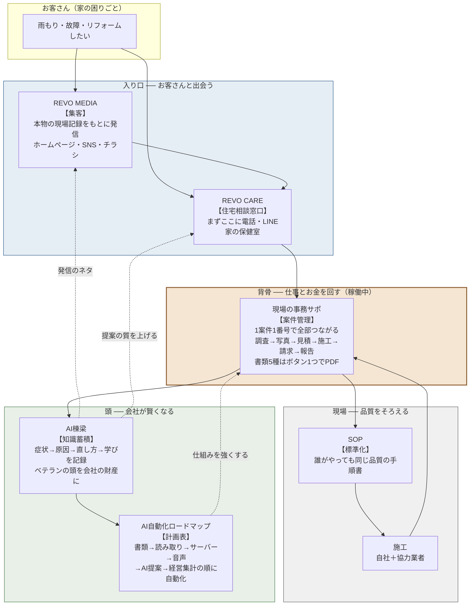
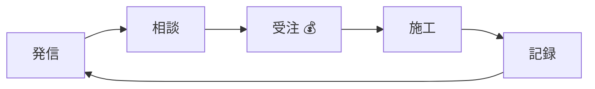

# REVO OS 全体構造図（1ページ版）

**家の困りごとを解決する仕事を、最初から最後まで、忘れずに・速く・同じ品質でやるためのREVOの仕組み一式**

## この1枚の読み方

| 場所 | 部品 | ひとこと | 状態 |
|---|---|---|---|
| 入り口 | REVO MEDIA | 知ってもらう | 1年目に本格開始 |
| 入り口 | REVO CARE | 相談にのる | 1年目に窓口開設 |
| 背骨 | 現場の事務サポ | 仕事とお金を管理 | **すでに稼働中** |
| 現場 | SOP | 手順をそろえる | 第1号あり・1年目に10本へ |
| 頭 | AI棟梁 | やり方を貯める | 器は設計済み・1年目に開始 |
| 頭 | AI自動化ロードマップ | 機械にまかせる計画 | 第2段階まで完了 |

## お金と知識の流れ（要約）

- **お金の流れ**: 発信 → 相談 → 受注（工事の売上）
- **知識の流れ**: 施工 → 記録 → 次の発信・次の提案がうまくなる
- **1件工事をするたびに、会社の「頭」と「集客のタネ」が増える**

---

詳細は [REVO OS 事業計画書](./事業計画書.md)／資料全体の地図は [マスターインデックス](../00-master-index.md)
