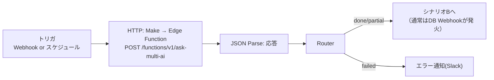
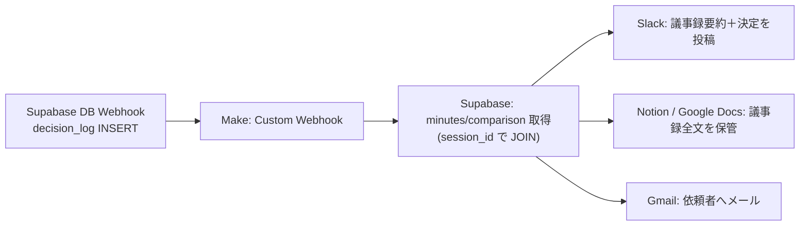

# Make シナリオ設計

Make は本システムの **入口（トリガ）** と **出口（通知・保管）** を担う。
LLM並列呼び出しやDB書き込みは Edge Function 側で完結させ、Make は「人・外部SaaSへ届ける」役に徹する。

---

## シナリオA: 入口（質問を投げる）



**HTTPモジュール設定**

| 項目 | 値 |
|------|----|
| URL | `https://<PROJECT_REF>.supabase.co/functions/v1/ask-multi-ai` |
| Method | POST |
| Header | `x-edge-token: <EDGE_SHARED_TOKEN>` / `Content-Type: application/json` |
| Body | `{ "question": "{{trigger.question}}", "context": "{{trigger.context}}", "requester": "{{trigger.requester}}" }` |
| Timeout | 180秒（3AI＋Judgeの合計を考慮） |

> UIから直接叩く場合はこのシナリオAは不要。Makeは定期質問（例: 毎朝の相場観確認）やフォーム連携で使う。

---

## シナリオB: 出口（Decision確定を配信）

Supabase の **Database Webhook**（`decision_log` の INSERT）を Make の Webhook で受け、分岐配信する。



**Supabase側 Database Webhook 設定**

- Table: `public.decision_log`
- Events: `INSERT`
- URL: Make の Custom Webhook URL
- Payload に `record`（新規行）が含まれる → `record.session_id` で関連データを引く。

**Slack投稿テンプレ例**

```
:white_check_mark: 意思決定が記録されました
*{{record.title}}*
決定: {{record.decision}}
根拠: {{record.rationale}}
信頼度: {{comparison.confidence}}
議事録: {{minutes.summary}}
```

---

## 環境変数（Make側 Connection / Data Store）

| 名前 | 用途 |
|------|------|
| `SUPABASE_FUNCTION_URL` | Edge Function ベースURL |
| `EDGE_SHARED_TOKEN` | `x-edge-token` に設定する共有トークン |
| `SUPABASE_URL` / `SUPABASE_ANON_KEY` | 関連データ取得用（読み取りはRLS+認証） |

---

## なぜ Make と Edge Function を分けるか

- **Edge Function** … 低遅延・秘密鍵管理・トランザクション的なDB書き込みが得意。
- **Make** … SlackやNotion等 **数百のSaaSコネクタ** とスケジュール実行をノーコードで持つ。
- LLM呼び出しをMakeのHTTPモジュールで3本並列に組むより、Edge Functionの `Promise.allSettled` で一括制御した方が **部分障害・タイムアウト・コスト記録** を一貫管理できる。
